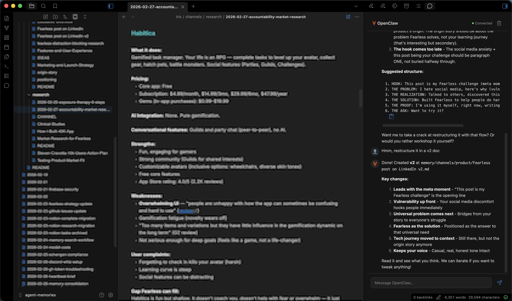
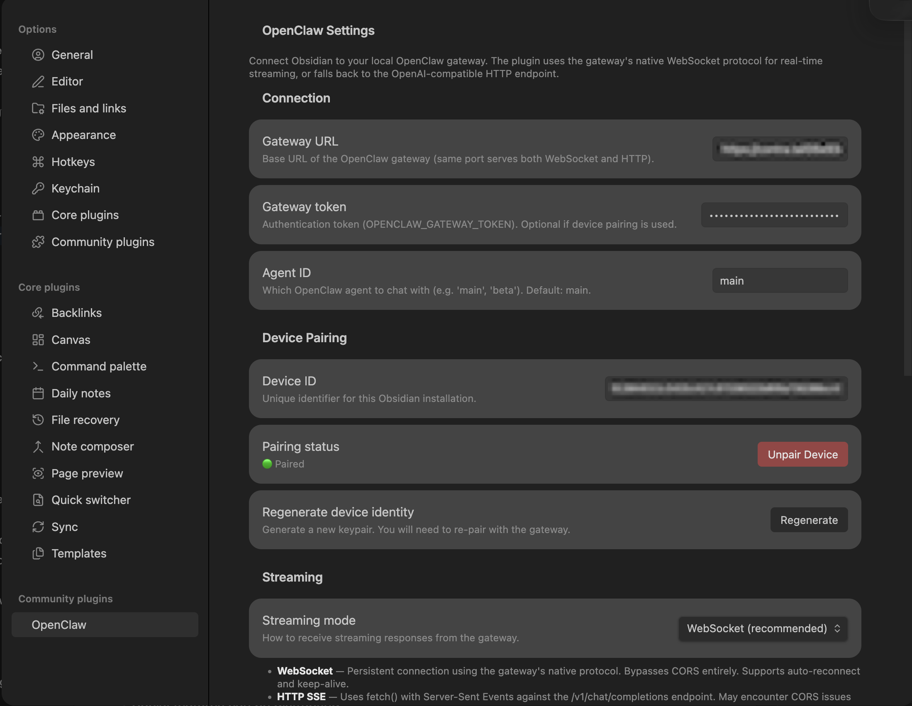

# Obsidian OpenClaw

Chat with your [OpenClaw](https://openclaw.ai) AI assistant directly inside your Obsidian vault.


## Features

### 🦞 Sidebar Chat
- Full chat interface in Obsidian's right sidebar
- Real-time streaming responses via WebSocket
- Markdown rendering for code blocks, lists, and rich text
- Message history within session

### ⚡ WebSocket Streaming
- Persistent connection using the gateway's native protocol
- Auto-reconnect with exponential backoff
- Keep-alive pings
- Live connection status display

### 📄 Context Awareness
- Automatically detects the active file in your editor
- Optionally sends the current file path with your messages
- Shares selected text as context so the agent knows what you're looking at
- The agent can read/write vault files via OpenClaw tools

### 🔐 Device Pairing
- Secure Ed25519 keypair-based authentication
- Automatic pairing with valid gateway token
- Device-specific token for future connections

## Setup

### Prerequisites

1. [OpenClaw](https://openclaw.ai) installed and running locally
2. Gateway started: `openclaw gateway start`
3. Gateway token set (via `OPENCLAW_GATEWAY_TOKEN` env var or `--token` flag)

### Install the Plugin

#### From Source (recommended)

```bash
git clone https://github.com/shawnohail/obsidian-openclaw.git
cd obsidian-openclaw
npm install
npm run build
./install.sh
```

The install script will prompt for your vault path, validate it, and copy
the built plugin files into `.obsidian/plugins/obsidian-openclaw/`. If you
have [obsidian-cli](https://github.com/Yakitrak/obsidian-cli) installed it
will offer your default vault automatically.

You can also pass the vault path directly:

```bash
./install.sh ~/my-vault
```

**After installation, restart Obsidian** (or reload without restart) for the plugin to appear.

#### Manual Installation

1. Download `main.js` and `manifest.json` from the [latest release](https://github.com/shawnohail/obsidian-openclaw/releases)
2. Create a folder `obsidian-openclaw` in your vault's `.obsidian/plugins/` directory
3. Copy the downloaded files into that folder
4. Restart Obsidian
5. Go to Settings → Community plugins and enable "OpenClaw"

### Configuration

1. **Enable WebSocket connections** on the gateway:
   ```bash
   openclaw gateway config.patch --raw '{"gateway":{"controlUi":{"allowedOrigins":["null"]}}}'
   openclaw gateway restart
   ```

2. Open Obsidian Settings → OpenClaw

3. Set your gateway URL (default: `http://localhost:18789`)

4. Test the connection with the "Test" button

5. Enter your gateway token (from `OPENCLAW_GATEWAY_TOKEN`)

6. Click "Pair Device" — pairing is automatic with a valid token

7. Status will change to 🟢 Paired

## Usage

1. Click the chat bubble icon in the left ribbon, or use the command palette: "OpenClaw: Open chat"
2. Type your message and press Enter
3. The agent will respond in real-time
4. **Context sharing:**
   - Enable "Share active file path" to send the current file's path
   - Enable "Share selected text" to include highlighted text as context

## Known Issues

The following issues are currently being investigated:

### 1. Gateway token required for pairing

**Issue:** Device pairing currently requires a gateway token, but we believe it should allow pairing requests without one (similar to Discord/Telegram channel pairing).

**Cause:** Unknown. The gateway rejects pairing attempts without a token, even though the plugin is requesting minimal scopes (`operator.read`, `operator.write`).

### 2. Unpair device doesn't remove from gateway

**Issue:** Clicking "Unpair Device" in the plugin settings clears local state but does not remove the device from the gateway's paired device list.

**Workaround:** Manually remove the device using the CLI:
```bash
openclaw devices list  # Find your device ID
openclaw devices remove <device-id>
```

### 3. No workaround for allowedOrigins configuration

**Issue:** Obsidian's Electron environment requires `"null"` in the gateway's `allowedOrigins` list for WebSocket connections to work, but there's no known workaround if you can't modify the gateway config.

**Required config:**
```bash
openclaw gateway config.patch --raw '{"gateway":{"controlUi":{"allowedOrigins":["null"]}}}'
openclaw gateway restart
```

---

If you encounter any of these issues or have solutions, please open an issue on the [GitHub repository](https://github.com/shawnohail/obsidian-openclaw/issues).


## Architecture

The plugin connects to the OpenClaw gateway using WebSocket (`ws://<gateway-url>/ws`) with the gateway's native JSON-RPC protocol:

- **Persistent connection** with automatic reconnection
- **Keep-alive pings** to detect connection drops
- **Device pairing** using Ed25519 signatures (auto-approves with valid token)
- **Token + device auth** for secure communication


## Development

```bash
# Clone and install dependencies
git clone https://github.com/shawnohail/obsidian-openclaw.git
cd obsidian-openclaw
npm install

# Build
npm run build

# Lint
npm run lint

# Test
npm run test

# Auto-install to vault
./install.sh ~/path/to/vault
```

## License

MIT — see [LICENSE](LICENSE)

## Links

- [OpenClaw](https://openclaw.ai)
- [OpenClaw GitHub](https://github.com/openclaw/openclaw)
- [Obsidian](https://obsidian.md)

## Screenshots



*Real-time chat with your OpenClaw agent directly in Obsidian*



*Configure connection, device pairing, and streaming options*
